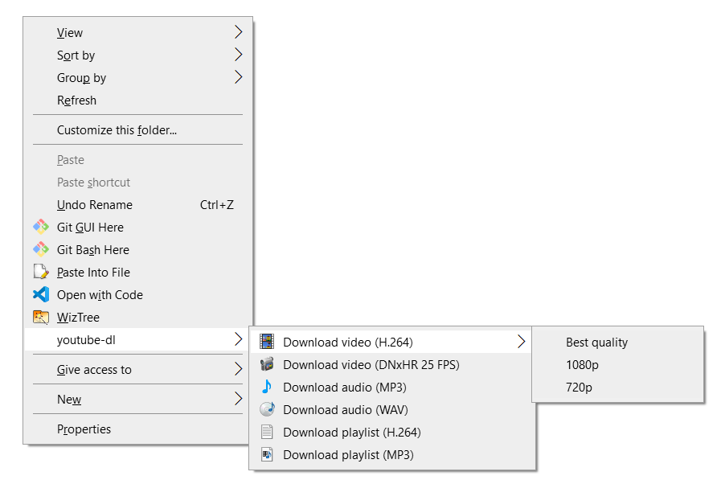

# yt-dlp and ffmpeg Windows Explorer Integration

Download videos from YouTube/Twitch/Twitter and more (any platform that is supported by yt-dlp) right in the Windows Explorer, without installing any shady shareware apps!


I made this script for myself, since I reference other YouTube videos and memes a lot in my own content and needed an easy way to download videos in an editing-friedly format (DNxHR 25 FPS in my case).
[Download the latest version](https://github.com/notthebee/ytdl-explorer/archive/refs/heads/main.zip)

Download videos from YouTube/Twitch/Twitter and more (any platform that is supported by yt-dlp) right in the Windows Explorer, without installing any shady shareware apps!



I made this script for myself, since I reference other YouTube videos and memes a lot in my own content and needed an easy way to download videos in an editing-friedly format (DNxHR 25 FPS in my case). The script will also update yt-dlp automatically if a new version is detected.

### Supported formats:

- Audio: MP3, WAV
- Video: MP4 H.264, MOV DNxHR

### How to use it

1. Right-click on "Raw" and save the file
2. Double-click on the .reg file and confirm adding the keys to the registry
3. Copy the video link, go to the folder where you want to download it
4. Right click on the empty space and choose your option
5. Voilà!
6. [Download the ZIP archive of this repository](https://github.com/notthebee/ytdl-explorer/archive/refs/heads/main.zip)
7. Unpack the archive
8. Double-click on the ytdl.reg file and confirm adding the keys to the registry
9. Copy the video link, go to the folder where you want to download it
10. Right click on the empty space and choose your option
11. Voilà!

This script requires **yt-dlp** and **ffmpeg**.
**To install yt-dlp and ffmpeg:**

Open a PowerShell as Administrator and run:

```
Set-ExecutionPolicy Bypass -Scope Process
Set-ExecutionPolicy Bypass -Scope Process -Force; [System.Net.ServicePointManager]::SecurityProtocol = [System.Net.ServicePointManager]::SecurityProtocol -bor 3072; iex ((New-Object System.Net.WebClient).DownloadString('https://chocolatey.org/install.ps1'))
choco install yt-dlp ffmpeg
```

### Uninstalling ytdl-explorer

To uninstall the script, Double-click on the uninstall.reg file and confirm the changes.
